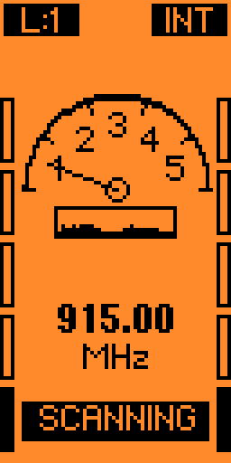

# RF Bug Seeker for Flipper Zero

<p align="center">
  
</p>

*Read this in other languages: [English](#english) | [Türkçe](#türkçe)*

---

## <a name="english"></a> 🇬🇧 English

### Overview


**RF Bug Seeker** is a professional-grade hidden camera and RF bug detector application designed for the Flipper Zero. Built exclusively for the Momentum firmware, it leverages the advanced `subghz_devices` API to turn your Flipper into an industrial-style signal sweeper.

Whether you are sweeping a hotel room for hidden transmitters, testing your own RF equipment, or analyzing a localized jamming signal, this application provides pinpoint accuracy with an intuitive, analog-style vertical interface.

### Key Features
* **Zone-Based Smart Filtering:** Automatically filters out the Flipper's internal hardware noise (e.g., the 924-928MHz phantom signals) while maintaining ultra-high sensitivity (-65dBm) across the rest of the spectrum.
* **Geiger-Counter Feedback:** Features synchronized high-pitch audio clicks and haptic vibration pulses that intensify as you approach the signal source.
* **Hybrid Precision Scanning:** Prioritizes scanning a curated list of common surveillance and remote frequencies before sweeping the entire Sub-GHz range (300-348, 387-464, 779-928 MHz).
* **Auto-Detect External Hardware:** Seamlessly detects and utilizes an external CC1101 module (EXT) when connected via GPIO, defaulting back to the internal antenna (INT) when removed.
* **Premium Vertical UI:** Features a 5-segment animated analog gauge, dynamic side power bars, a 32-sample live "waterfall" signal history graph, and inverted contrast status indicators.

### 🚀 Extensibility Note (1MHz - 6.5GHz)
While this application currently operates strictly within the frequency range of the native CC1101 module (Sub-GHz), the codebase is designed to be highly modular. With simple modifications to the source code and the addition of third-party wideband SDR or RF modules, you can easily upgrade this project to scan the **1MHz to 6.5GHz** range, turning it into a truly professional sweeping rig!

### Controls
* **Up / Down:** Manually adjust the signal detection threshold (Sensitivity).
* **Ok (Short / Long Press):** Unlock the current frequency and force the device to resume scanning.
* **Back:** Safely power down the radio hardware and exit the application.

### Installation
This application requires the [Momentum Firmware](https://github.com/Next-Flip/Momentum-Firmware) due to its dependency on advanced hardware APIs.

1. Clone or copy this repository into your firmware's `applications_user` directory:
```bash
cp -r rf_bug_seeker /path/to/Momentum-Firmware/applications_user/
```

2. Compile the application using the `fbt` build system:
```bash
cd /path/to/Momentum-Firmware/
./fbt applications_user/rf_bug_seeker/
```

3. Copy the resulting `.fap` file to your Flipper Zero's SD Card:
```bash
cp build/f7-firmware-C/.extapps/rf_bug_seeker.fap /media/YOUR_SD_CARD/apps/Sub-GHz/
```

### License
This project is open-source and free to use for educational and security research purposes.

---

## <a name="türkçe"></a> 🇹🇷 Türkçe

### Genel Bakış


**RF Bug Seeker**, Flipper Zero için tasarlanmış profesyonel düzeyde bir gizli kamera ve RF böcek (dinleme cihazı) tespit uygulamasıdır. Momentum firmware için özel olarak geliştirilmiş olup, Flipper'ınızı endüstriyel standartlarda bir sinyal tarayıcıya dönüştürmek için gelişmiş `subghz_devices` API'sini kullanır.

Otel odalarında gizli verici taraması yapmak, kendi RF ekipmanlarınızı test etmek veya ortamdaki sinyal bozucuları (jammer) analiz etmek için ihtiyacınız olan tüm hassasiyeti, analog tarzı dikey arayüzü ile sunar.

### Temel Özellikler
* **Bölgesel Akıllı Filtreleme (Zone-Based Smart Filtering):** Spektrumun geri kalanında ultra yüksek hassasiyeti (-65dBm) korurken, Flipper'ın kendi donanımından kaynaklanan iç gürültüleri (örneğin 924-928MHz hayalet sinyallerini) otomatik olarak filtreler.
* **Geiger Sayacı Geri Bildirimi:** Sinyal kaynağına yaklaştıkça yoğunlaşan senkronize yüksek frekanslı ses tıkırtıları (click) ve titreşim vurumları sağlar.
* **Hibrit Hassas Tarama:** Tüm Sub-GHz aralığını (300-348, 387-464, 779-928 MHz) taramadan önce, yaygın olarak bilinen casus ve uzaktan kumanda frekanslarını içeren öncelikli bir listeyi tarar.
* **Otomatik Harici Donanım Tespiti:** GPIO üzerinden bağlandığında harici bir CC1101 modülünü (EXT) otomatik olarak algılar ve kullanır. Çıkarıldığında varsayılan olarak dahili antene (INT) döner.
* **Premium Dikey Arayüz:** 5 kademeli animasyonlu analog gösterge, dinamik yan güç çubukları, 32 örneklemeli canlı "şelale" (waterfall) sinyal geçmişi grafiği ve ters kontrast durum göstergeleri sunar.

### 🚀 Geliştirilebilirlik Notu (1MHz - 6.5GHz)
Bu uygulama şu anda yalnızca yerel CC1101 modülünün (Sub-GHz) frekans aralığında çalışsa da, kod yapısı tamamen modüler olacak şekilde tasarlanmıştır. Kaynak kodunda yapacağınız basit müdahaleler ve üçüncü parti geniş bant SDR veya RF donanım modülleri ekleyerek, bu projeyi kolayca **1MHz ile 6.5GHz** aralığını tarayacak şekilde yükseltebilir ve tam profesyonel bir tarama cihazına dönüştürebilirsiniz!

### Kontroller
* **Yukarı / Aşağı:** Sinyal algılama eşiğini (Hassasiyet) manuel olarak ayarlayın.
* **Ok (Kısa / Uzun Basım):** Kilitlenen frekansı serbest bırakın ve cihazı taramaya devam etmeye zorlayın.
* **Geri:** Radyo donanımını güvenli bir şekilde kapatın ve uygulamadan çıkın.

### Kurulum
Bu uygulama, gelişmiş donanım API'lerine olan bağımlılığı nedeniyle [Momentum Firmware](https://github.com/Next-Flip/Momentum-Firmware) gerektirir.

1. Bu depoyu klonlayın veya firmware'inizin `applications_user` dizinine kopyalayın:
```bash
cp -r rf_bug_seeker /path/to/Momentum-Firmware/applications_user/
```

2. Uygulamayı `fbt` derleme sistemini kullanarak derleyin:
```bash
cd /path/to/Momentum-Firmware/
./fbt applications_user/rf_bug_seeker/
```

3. Oluşan `.fap` dosyasını Flipper Zero'nuzun SD Kartına kopyalayın:
```bash
cp build/f7-firmware-C/.extapps/rf_bug_seeker.fap /media/YOUR_SD_CARD/apps/Sub-GHz/
```

### Lisans
Bu proje açık kaynaklıdır ve eğitim ile güvenlik araştırmaları amacıyla kullanılması ücretsizdir.
